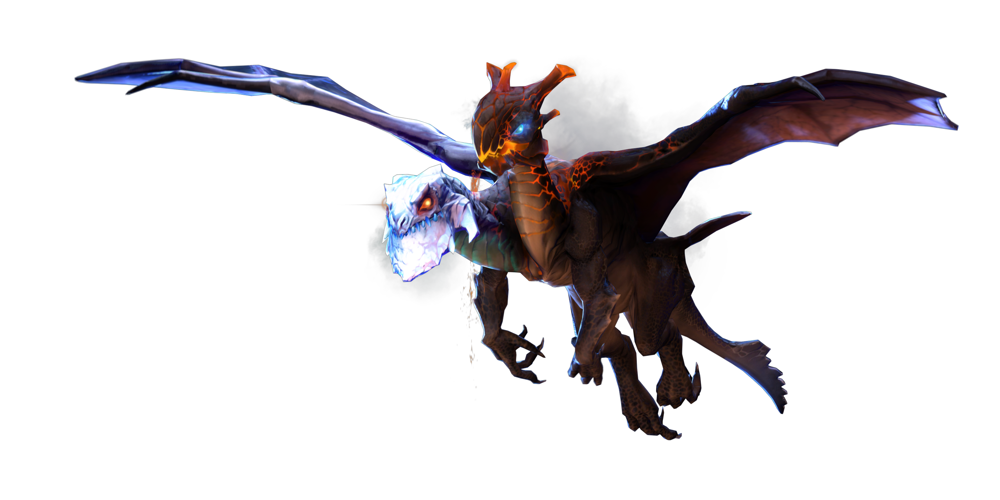
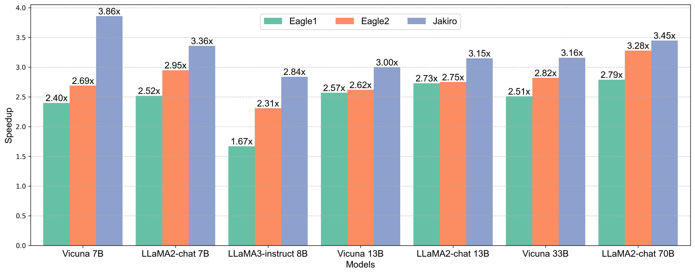

<h1>&nbsp;Jakiro</h1>

This repository is the official implementation of "Jakiro: Boosting Speculative Decoding with Decoupled Multi-Head via MoE"

| <a href="https://arxiv.org/pdf/"><b>Paper (Jakiro)</b></a> | 

  
  
  

##

  

**Jakiro** is an advanced approach designed to enhance speculative decoding (SD) for large language models. By integrating Mixture of Experts (MoE), Jakiro enables independent experts to generate diverse predictions, effectively decoupling correlations among candidates and addressing a key limitation of traditional tree-based sampling. Jakiro significantly boosts prediction accuracy and inference speed, setting a new state-of-the-art (SOTA) in speculative decoding. Extensive experiments across various models demonstrate its robustness and effectiveness in real-world applications.
